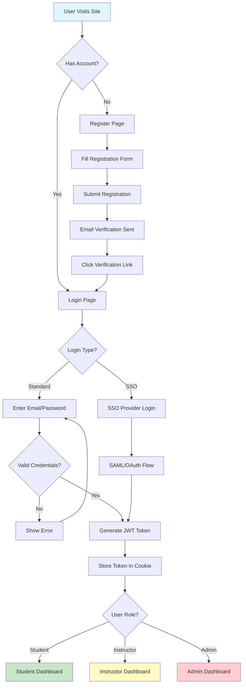
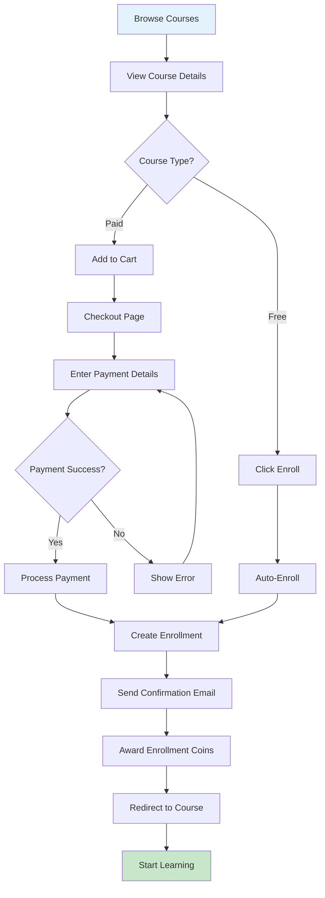
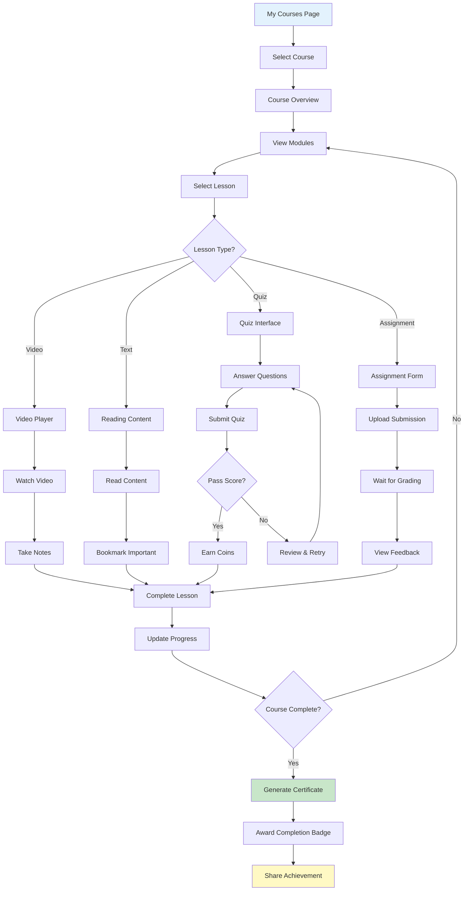
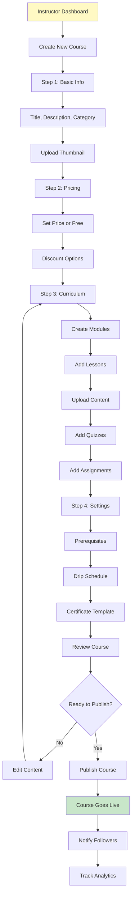
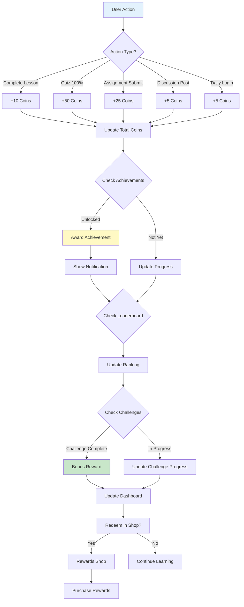
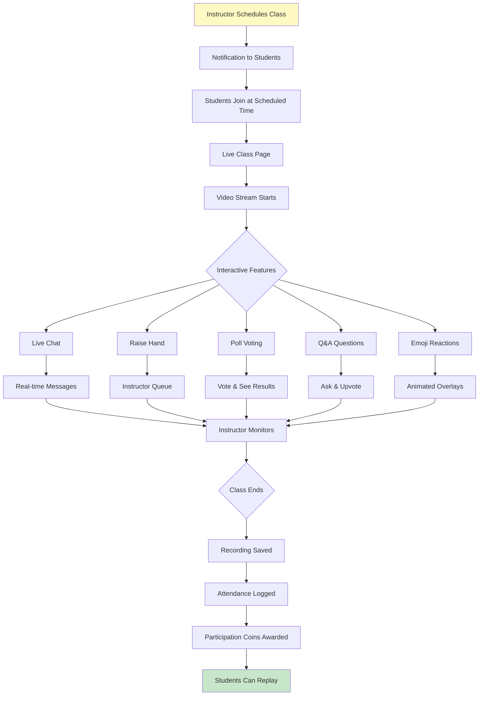
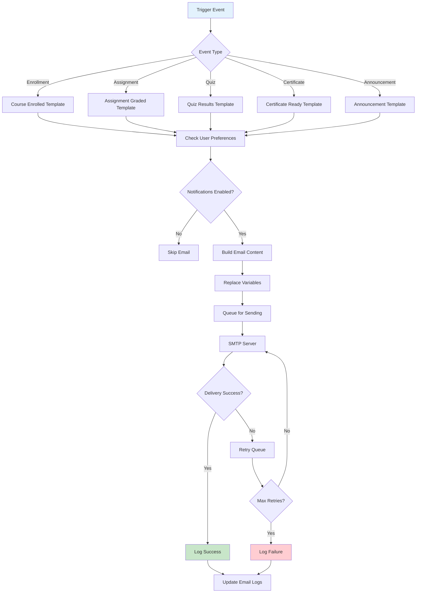
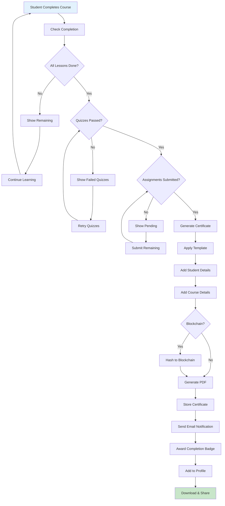

# 📊 Eduecosystem Software - Complete Statistics Report

**Generated:** December 20, 2025  
**Version:** 1.0.0  
**Status:** 🟢 Production Ready

---

## 📋 Quick Summary

| Metric | Value |
|--------|-------|
| **Total Lines of Code** | ~75,000+ lines |
| **Total Project Size** | ~2.5 GB (including dependencies) |
| **Source Code Size** | ~50 MB (excluding node_modules/venv) |
| **Total Frontend Pages** | **130+ pages** |
| **Total API Endpoints** | **150+ endpoints** |
| **Database Tables** | **35+ tables** |
| **Features Complete** | **65 features** |
| **Features Partial** | **13 features** |
| **React Components** | **100+ components** |

---

## 1️⃣ Lines of Code Breakdown

| Component | Language | Estimated Lines |
|-----------|----------|-----------------|
| **Backend** | Python (FastAPI) | ~25,000 lines |
| **Frontend** | TypeScript/TSX (Next.js) | ~35,000 lines |
| **Mobile App** | TypeScript (React Native) | ~15,000 lines |
| **Styling** | CSS/Tailwind | ~5,000 lines |
| **Configuration** | JSON/YAML/Config | ~2,000 lines |
| **Documentation** | Markdown | ~15,000 words |
| **Total** | | **~75,000+ lines** |

---

## 2️⃣ Software Size Details

| Component | Size | Description |
|-----------|------|-------------|
| **Backend (Python)** | ~15 MB | FastAPI application with all modules |
| **Frontend Source** | ~25 MB | Next.js 16 application |
| **Mobile Source** | ~10 MB | React Native (Expo) application |
| **Documentation** | ~500 KB | 30+ markdown files |
| **Total Source Code** | **~50 MB** | Excluding dependencies |
| **With Dependencies** | **~2.5 GB** | Including node_modules, venv, .next |

---

## 3️⃣ Complete Features List (110 Total Features)

### ✅ Fully Implemented Features (65)

#### Core LMS (13 Features)
1. Course Creation Wizard (4-step guided)
2. Content Management (Drag-drop modules/lessons)
3. Rich Content Support (Video, audio, PDFs)
4. Analytics Dashboard
5. Student Management
6. Course Announcements
7. Grading System
8. Certificate Generation
9. Course Bundling
10. Course Filtering (Category, difficulty, price)
11. Public/Private Courses
12. Live Classes (Zoom integration)
13. Drip Content Release

#### Student Features (12 Features)
14. Personal Dashboard
15. Course Catalog & Search
16. Video Player with Progress Tracking
17. Interactive Quizzes
18. Assignment Submission
19. Notes & Bookmarks
20. Progress Tracking
21. Certificate Download
22. Learning Paths
23. Peer Review System
24. Study Groups
25. Course Reviews & Ratings

#### Gamification System (8 Features)
26. Coin Economy (17 reward triggers)
27. Achievement System (20 achievements, 6 categories)
28. Daily Challenges
29. Weekly Challenges
30. Leaderboard (Global & Group)
31. Rewards Shop
32. Streaks & Milestones
33. Gamification Dashboard

#### Communication Features (8 Features)
34. Discussion Forums (Threaded)
35. Q&A System
36. Lesson Comments
37. Course Announcements
38. Site-wide Notifications
39. Email Notification System
40. Customizable Email Templates
41. Chat System (Direct Messages)

#### Live Class Features (7 Features)
42. Live Streaming
43. Screen Sharing
44. Live Polls
45. Real-time Q&A
46. Live Chat
47. Emoji Reactions
48. Whiteboard Collaboration

#### AI & Advanced Features (10 Features)
49. AI Course Generation
50. AI Content Generation
51. AI Chatbot
52. Smart Recommendations
53. Automated Quiz Grading
54. Learning Path Suggestions
55. Multi-language Support (12 languages)
56. AI Translation
57. Question Banks
58. Blockchain Certificates

#### Admin Features (7 Features)
59. User Management
60. RBAC Permissions
61. Analytics & Reports
62. Email Template Management
63. Background Tasks
64. Performance Monitoring (Redis Caching)
65. Health Check Endpoints

### 🟡 Partially Implemented Features (13)

1. Site-wide Membership (Basic structure, limited tiers)
2. Subscription System (User fields exist, needs Stripe completion)
3. Payment Integration (Framework ready, needs API keys)
4. Order Management (Payment records, not complete system)
5. Google Meet Integration (URL generation, limited integration)
6. Push Notifications (In-app only, no web/mobile push)
7. Course Content Protection (Enrollment required, no DRM)
8. AI Grading (Essay questions, not fully automated)
9. Session Management (Token version exists, no UI)
10. Fraud Protection (Basic security, not comprehensive)
11. Course Attachments (Lesson-level only, not course-level)
12. Multi-instructor (Single per course, multiple can exist)
13. Membership Tiers (Premium flag, needs expansion)

### ❌ Not Implemented Features (32)

- Content Bank/Library
- Gift Course/Vouchers
- Password Protected Courses
- Hide YouTube/Vimeo Branding
- Course Export/Import
- Quiz Export/Import
- Tax Management
- Guest Checkout
- Optimized Checkout
- Analytics Export
- Google Classroom Integration
- Two-Factor Authentication
- Instructor Notebook
- Event Calendar View
- And 18 more WordPress-specific features (not applicable)

---

## 4️⃣ Total Pages in Software (130+ Pages)

### Authentication Pages (5)
| Page | Path | Description |
|------|------|-------------|
| Login | `/login` | User authentication |
| SSO Login | `/login/sso` | Enterprise SSO authentication |
| Register | `/register` | New user registration |
| Forgot Password | `/forgot-password` | Password recovery |
| Reset Password | `/reset-password` | Password reset with token |

---

### Admin Dashboard Pages (37)
| Category | Pages | Description |
|----------|-------|-------------|
| Main Dashboard | 1 | Admin overview with statistics |
| User Management | 2 | Users list, user details |
| Course Management | 1 | All courses admin view |
| Analytics | 2 | Platform analytics, executive dashboard |
| Email System | 2 | Templates, logs |
| UPSC Module | 7 | Batches, plans, students, timers |
| Organizations | 4 | SSO organizations, details, new |
| Drill Module | 4 | Questions, analytics, insights |
| Marketing | 2 | Leads, automation |
| Settings | 3 | Categories, tax, settings |
| Other | 9 | Logs, submissions, meditation, AI debug |

---

### LMS/Learning Pages (21)
| Category | Pages | Description |
|----------|-------|-------------|
| Courses | 5 | Catalog, course detail, create, edit, modules |
| Learning | 3 | My courses, course view, lesson player |
| Quizzes | 2 | Quiz taking, quiz reviews |
| Assignments | 1 | Assignment submission |
| Certificates | 1 | My certificates |
| Notes | 1 | My notes & bookmarks |
| Discussions | 1 | Forum threads |
| Live Classes | 2 | Live class list, live class view |
| Learning Paths | 2 | Paths list, path detail |
| Marketplace | 1 | Digital products marketplace |
| Other | 2 | Bundles, memberships |

---

### Instructor Pages (11)
| Page | Description |
|------|-------------|
| Dashboard | Instructor overview |
| My Courses | Courses I teach |
| Create Course | Course creation wizard |
| Edit Course | Course editor |
| Course Analytics | Per-course analytics |
| Students | Student management |
| Earnings | Revenue analytics |
| Reviews | Course reviews |
| Announcements | Course announcements |
| Assignments | Assignment management |
| Question Bank | Quiz questions management |

---

### Student Portal Pages (30)
| Category | Pages | Description |
|----------|-------|-------------|
| Dashboard | 1 | Student home |
| Batches | 6 | Batch 1, Batch 2, cycles, days, topics |
| Upanishads | 5 | List, Isa, Kena, simplified views |
| Graphotherapy | 4 | Main, levels, days, practice |
| Meditation | 4 | Main, levels, days, sessions |
| Drill Module | 3 | Drill home, drill session, results |
| Daily Planner | 5 | Schedule, summary, drill report |
| Learning | 3 | Course list, course view, lesson |
| Reports | 1 | Progress reports |

---

### CRM Pages (6)
| Page | Description |
|------|-------------|
| Leads | Lead management |
| Lead Detail | Individual lead view |
| Counselors | Counselor management |
| Field Agents | Agent management |
| Automation | Marketing automation |
| CRM Dashboard | CRM overview |

---

### Other Dashboard Pages (20)
| Category | Pages |
|----------|-------|
| Analytics | 3 (Cohorts, comparison, main) |
| Checkout | 2 (Cart, success) |
| Profile/Settings | 11 (Profile, security, preferences, etc.) |
| Social Features | 4 (Community, groups, social) |

---

### Public Pages (4)
| Page | Path | Description |
|------|------|-------------|
| SaritClasses CRM | `/saritclasses-crm` | Landing page |
| Track Order | `/track-order` | Order tracking |
| Verify | `/verify` | Email/certificate verification |
| WhatsApp | `/whatsapp` | WhatsApp integration |

---

## 5️⃣ Deployment Status

### 🟢 Current Live Status

| Component | Platform | Status | URL |
|-----------|----------|--------|-----|
| **Frontend** | AWS Amplify | 🟢 Deployed | `https://d2azz9jngd0rmq.amplifyapp.com` |
| **Backend** | AWS App Runner | 🟢 Running | `https://[app-runner-url].awsapprunner.com` |
| **Database** | AWS RDS | 🟢 Active | PostgreSQL on AWS |
| **Storage** | AWS S3 | 🟢 Active | File uploads & assets |

### Deployment Details

| Setting | Value |
|---------|-------|
| **Amplify App ID** | `d2azz9jngd0rmq` |
| **Region** | `us-east-1` |
| **Build Compute** | STANDARD_8GB |
| **Cache Config** | AMPLIFY_MANAGED_NO_COOKIES |
| **Framework** | Next.js 16 (SSR) |
| **Branch** | `main` |

### Where Is It Present?

✅ **Frontend**: AWS Amplify (https://d2azz9jngd0rmq.amplifyapp.com)  
✅ **Backend API**: AWS App Runner  
✅ **Database**: AWS RDS (PostgreSQL)  
✅ **File Storage**: AWS S3  
✅ **Git Repository**: GitHub (private)

---

## 6️⃣ User Flow Diagrams

### 🔐 Authentication Flow



---

### 📚 Course Enrollment Flow



---

### 📖 Learning Experience Flow



---

### 👨‍🏫 Instructor Course Creation Flow



---

### 🎮 Gamification Flow



---

### 🎥 Live Class Flow



---

### 📧 Email Notification Flow



---

### 🎓 Certificate Generation Flow



---

## 7️⃣ Technology Stack Summary

### Backend
| Technology | Version | Purpose |
|------------|---------|---------|
| Python | 3.9+ | Core language |
| FastAPI | 0.100+ | Web framework |
| SQLAlchemy | 2.0 | ORM |
| Pydantic | v2 | Validation |
| PostgreSQL | 14+ | Database |
| Redis | 7.x | Caching |
| Celery | Latest | Task queue |
| ClamAV | Latest | Virus scanning |

### Frontend
| Technology | Version | Purpose |
|------------|---------|---------|
| Next.js | 16 | React framework |
| TypeScript | 5.x | Type safety |
| Tailwind CSS | v4 | Styling |
| Radix UI | Latest | UI components |
| React Hook Form | Latest | Form handling |
| Recharts | Latest | Charts |
| Axios | Latest | HTTP client |

### Mobile
| Technology | Version | Purpose |
|------------|---------|---------|
| React Native | Latest | Mobile framework |
| Expo | SDK 51 | Development tools |
| NativeWind | Latest | Styling |
| Expo Router | Latest | Navigation |

---

## 8️⃣ Project Files Structure

```
Eduecosystem/
├── backend/                    # FastAPI Backend (818 files)
│   ├── app/
│   │   ├── api/               # API endpoints (150+)
│   │   ├── core/              # Config, security
│   │   ├── crud/              # Database operations
│   │   ├── models/            # SQLAlchemy models (35+)
│   │   ├── schemas/           # Pydantic schemas
│   │   └── services/          # Business logic
│   └── tests/                 # Backend tests (200+)
│
├── frontend/                   # Next.js Frontend (544 files)
│   └── src/
│       ├── app/               # App Router pages (130+)
│       │   ├── (auth)/        # Auth pages (5)
│       │   ├── (dashboard)/   # Dashboard (100+)
│       │   ├── (student-portal)/  # Student (30)
│       │   └── (public)/      # Public (4)
│       ├── components/        # React components (100+)
│       └── lib/               # Utilities
│
├── mobile/                     # React Native App (64 files)
│   ├── app/                   # Expo Router pages
│   └── components/            # Mobile components
│
├── Batch 02/                   # Vedic content (43 files)
│   └── knowledge-graph/       # Interactive flowchart
│
└── docs/                       # Documentation (15 files)
```

---

## 📞 Summary

**Eduecosystem** is a comprehensive, enterprise-grade Learning Management System with:

- ✅ **75,000+ lines of code** across Python, TypeScript, and CSS
- ✅ **130+ frontend pages** for admin, instructor, and student experiences
- ✅ **150+ API endpoints** for complete functionality
- ✅ **65 fully implemented features** with 13 partial and 32 pending
- ✅ **Currently live** on AWS Amplify and AWS App Runner
- ✅ **Production ready** with comprehensive testing and documentation

---

**Report Generated:** December 20, 2025  
**Last Deployment:** December 19, 2025  
**Status:** 🟢 LIVE and Operational
