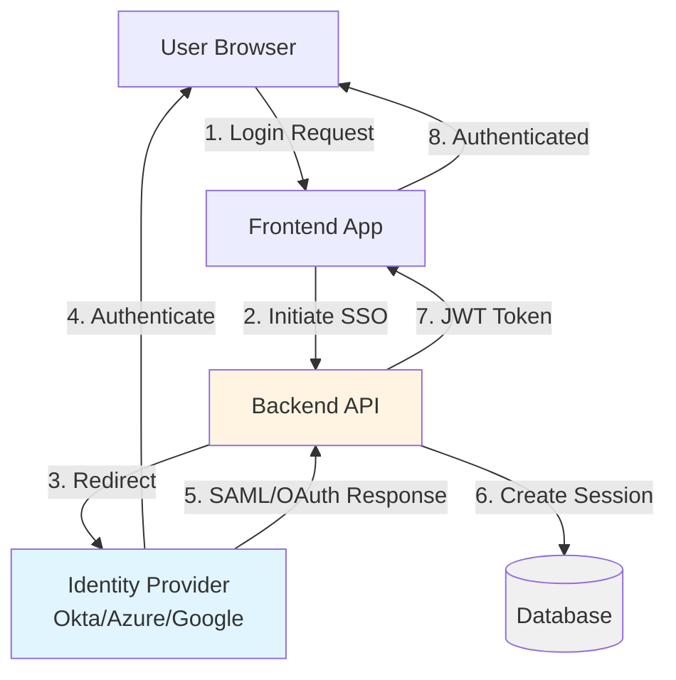
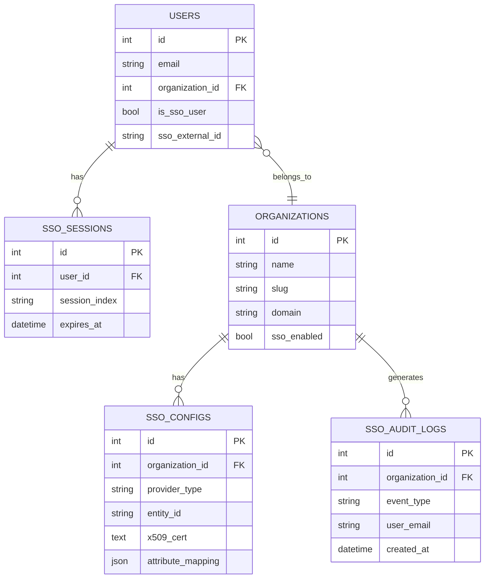
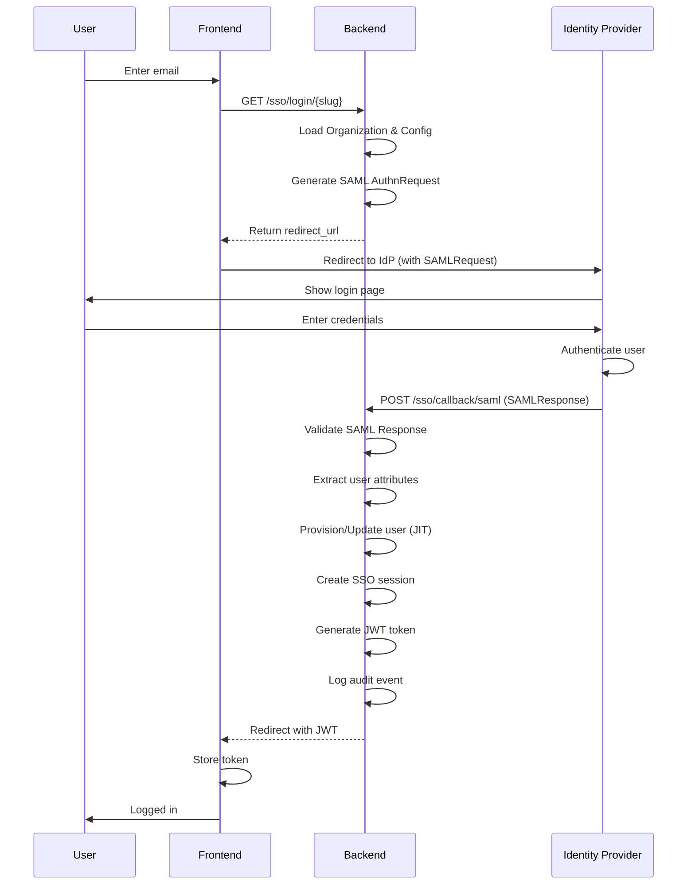
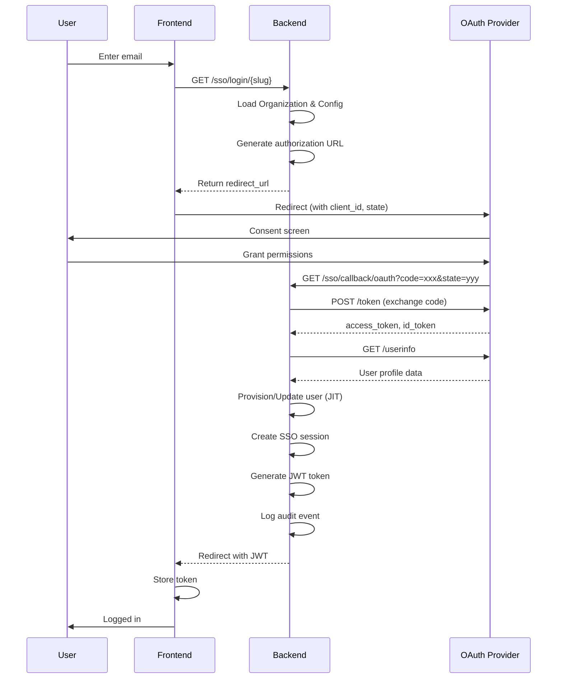

# Enterprise SSO Developer Documentation

## Table of Contents

1. [Architecture Overview](#architecture-overview)
2. [Authentication Flows](#authentication-flows)
3. [API Reference](#api-reference)
4. [Integration Guide](#integration-guide)
5. [Security Considerations](#security-considerations)
6. [Troubleshooting](#troubleshooting)

---

## Architecture Overview

### System Components



### Database Schema



---

## Authentication Flows

### SAML 2.0 Flow



### OAuth 2.0 Flow



---

## API Reference

### Base URL

```
Production: https://your-domain.com/api/v1
Development: http://localhost:8000/api/v1
```

### Authentication

Most endpoints require JWT authentication:

```http
Authorization: Bearer <jwt_token>
```

Admin endpoints require `admin` or `superuser` role.

---

### Organization Management

#### List Organizations

```http
GET /organizations
Authorization: Bearer <admin_token>
```

**Response:**
```json
[
  {
    "id": 1,
    "name": "Acme Corporation",
    "slug": "acme-corporation",
    "domain": "acme.com",
    "sso_enabled": true,
    "created_at": "2025-01-15T10:30:00Z"
  }
]
```

#### Create Organization

```http
POST /organizations
Authorization: Bearer <admin_token>
Content-Type: application/json

{
  "name": "Acme Corporation",
  "slug": "acme-corporation",
  "domain": "acme.com",
  "sso_enabled": true
}
```

**Response:** `200 OK` with organization object

#### Get Organization

```http
GET /organizations/{organization_id}
Authorization: Bearer <admin_token>
```

#### Update Organization

```http
PATCH /organizations/{organization_id}
Authorization: Bearer <admin_token>
Content-Type: application/json

{
  "name": "Acme Corp",
  "sso_enabled": false
}
```

#### Delete Organization

```http
DELETE /organizations/{organization_id}
Authorization: Bearer <admin_token>
```

---

### SSO Configuration

#### Get SSO Configuration

```http
GET /organizations/{organization_id}/sso-config
Authorization: Bearer <admin_token>
```

**Response:**
```json
{
  "id": 1,
  "organization_id": 1,
  "provider_type": "SAML",
  "provider_name": "Okta",
  "entity_id": "http://www.okta.com/exk123",
  "sso_url": "https://org.okta.com/app/sso/saml",
  "jit_enabled": true,
  "is_active": true
}
```

#### Save SSO Configuration

```http
POST /organizations/{organization_id}/sso-config
Authorization: Bearer <admin_token>
Content-Type: application/json

{
  "provider_type": "SAML",
  "provider_name": "Okta",
  "entity_id": "http://www.okta.com/exk123",
  "sso_url": "https://org.okta.com/app/sso/saml",
  "x509_cert": "-----BEGIN CERTIFICATE-----\n...\n-----END CERTIFICATE-----",
  "jit_enabled": true,
  "attribute_mapping": {
    "email": "email",
    "first_name": "firstName",
    "last_name": "lastName"
  }
}
```

**SAML Fields:**
- `provider_type`: "SAML"
- `entity_id`: IdP Entity ID
- `sso_url`: IdP SSO URL
- `x509_cert`: IdP X.509 Certificate
- `logout_url`: (Optional) IdP Logout URL

**OAuth Fields:**
- `provider_type`: "OAUTH"
- `client_id`: OAuth Client ID
- `client_secret`: OAuth Client Secret
- `authorization_endpoint`: OAuth Authorization URL
- `token_endpoint`: OAuth Token URL
- `userinfo_endpoint`: OAuth UserInfo URL
- `scopes`: Space-separated scopes (e.g., "openid email profile")

#### Test SSO Connection

```http
POST /organizations/{organization_id}/test-connection
Authorization: Bearer <admin_token>
```

**Response:**
```json
{
  "success": true,
  "message": "SSO configuration is valid",
  "details": {
    "certificate_valid": true,
    "endpoints_reachable": true,
    "metadata_parsed": true
  }
}
```

---

### SSO Authentication

#### Initiate SSO Login

```http
GET /sso/login/{organization_slug}
```

**Response:**
```json
{
  "redirect_url": "https://idp.example.com/sso?SAMLRequest=...",
  "method": "SAML"
}
```

This endpoint:
1. Looks up the organization by slug
2. Loads the SSO configuration
3. Generates the appropriate redirect URL (SAML AuthnRequest or OAuth authorization URL)
4. Returns the URL for the frontend to redirect to

#### SAML Callback (ACS)

```http
POST /sso/callback/saml
Content-Type: application/x-www-form-urlencoded

SAMLResponse=<base64_encoded_response>&RelayState=<state>
```

**Response:** Redirect to frontend with JWT token
```
HTTP/1.1 302 Found
Location: https://frontend.com/auth/callback?token=<jwt_token>
```

This endpoint:
1. Validates the SAML response signature
2. Extracts user attributes
3. Provisions or updates the user (if JIT enabled)
4. Creates an SSO session
5. Generates a JWT token
6. Logs the authentication event

#### OAuth Callback

```http
GET /sso/callback/oauth?code=<auth_code>&state=<state>
```

**Response:** Redirect to frontend with JWT token
```
HTTP/1.1 302 Found
Location: https://frontend.com/auth/callback?token=<jwt_token>
```

This endpoint:
1. Exchanges the authorization code for tokens
2. Retrieves user info from the IdP
3. Provisions or updates the user (if JIT enabled)
4. Creates an SSO session
5. Generates a JWT token
6. Logs the authentication event

#### Logout

```http
POST /sso/logout
Authorization: Bearer <jwt_token>
Content-Type: application/json

{
  "session_index": "<sso_session_index>"
}
```

**Response:**
```json
{
  "success": true,
  "logout_url": "https://idp.example.com/logout?SAMLRequest=..."
}
```

---

### Session Management

#### List SSO Sessions

```http
GET /organizations/{organization_id}/sessions
Authorization: Bearer <admin_token>
```

**Response:**
```json
[
  {
    "id": 1,
    "user_id": 42,
    "user_email": "john@acme.com",
    "session_index": "s2a4d6e8",
    "ip_address": "192.168.1.100",
    "expires_at": "2025-01-16T10:30:00Z",
    "created_at": "2025-01-15T10:30:00Z"
  }
]
```

#### Revoke SSO Session

```http
POST /organizations/{organization_id}/sessions/{session_id}/revoke
Authorization: Bearer <admin_token>
```

---

### Audit Logs

#### Get Audit Logs

```http
GET /organizations/{organization_id}/audit-logs
Authorization: Bearer <admin_token>
Query Parameters:
  - event_type: (optional) Filter by event type
  - user_email: (optional) Filter by user
  - start_date: (optional) ISO 8601 date
  - end_date: (optional) ISO 8601 date
  - skip: (optional) Pagination offset
  - limit: (optional) Results per page (default: 50)
```

**Response:**
```json
[
  {
    "id": 1,
    "organization_id": 1,
    "event_type": "login_success",
    "user_email": "john@acme.com",
    "ip_address": "192.168.1.100",
    "user_agent": "Mozilla/5.0...",
    "details": {
      "provider": "SAML",
      "session_index": "s2a4d6e8"
    },
    "created_at": "2025-01-15T10:30:00Z"
  }
]
```

**Event Types:**
- `login_success`: Successful SSO login
- `login_failure`: Failed SSO login attempt
- `logout`: User logout
- `session_revoked`: Admin revoked session
- `config_updated`: SSO configuration changed
- `jit_provision`: New user provisioned via JIT

---

## Integration Guide

### Frontend Integration

#### 1. Detect Organization from Email

```typescript
async function detectOrganization(email: string) {
  const domain = email.split('@')[1];
  
  const response = await fetch(`/api/v1/organizations?domain=${domain}`);
  const organizations = await response.json();
  
  if (organizations.length > 0 && organizations[0].sso_enabled) {
    return organizations[0];
  }
  
  return null;
}
```

#### 2. Initiate SSO Login

```typescript
async function initiateSSO(organizationSlug: string) {
  const response = await fetch(`/api/v1/sso/login/${organizationSlug}`);
  const { redirect_url } = await response.json();
  
  // Redirect user to IdP
  window.location.href = redirect_url;
}
```

#### 3. Handle SSO Callback

```typescript
// In your /auth/callback route
function handleSSOCallback() {
  const urlParams = new URLSearchParams(window.location.search);
  const token = urlParams.get('token');
  
  if (token) {
    // Store JWT token
    localStorage.setItem('auth_token', token);
    
    // Redirect to dashboard
    router.push('/dashboard');
  }
}
```

#### 4. Complete Login Component Example

```tsx
'use client';

import { useState } from 'react';
import { useRouter } from 'next/navigation';

export default function SSOLogin() {
  const [email, setEmail] = useState('');
  const [loading, setLoading] = useState(false);
  const router = useRouter();
  
  const handleLogin = async () => {
    setLoading(true);
    
    try {
      // Detect organization
      const domain = email.split('@')[1];
      const response = await fetch(`/api/v1/organizations?domain=${domain}`);
      const orgs = await response.json();
      
      if (orgs.length > 0 && orgs[0].sso_enabled) {
        // Initiate SSO
        const ssoResponse = await fetch(`/api/v1/sso/login/${orgs[0].slug}`);
        const { redirect_url } = await ssoResponse.json();
        
        // Redirect to IdP
        window.location.href = redirect_url;
      } else {
        // Fall back to regular login
        router.push('/login/password');
      }
    } catch (error) {
      console.error('SSO login failed:', error);
    } finally {
      setLoading(false);
    }
  };
  
  return (
    <div>
      <input
        type="email"
        value={email}
        onChange={(e) => setEmail(e.target.value)}
        placeholder="Enter your work email"
      />
      <button onClick={handleLogin} disabled={loading}>
        {loading ? 'Redirecting...' : 'Continue with SSO'}
      </button>
    </div>
  );
}
```

---

### Backend Integration Examples

#### Python: Validate JWT Token

```python
from fastapi import Depends, HTTPException, status
from fastapi.security import HTTPBearer, HTTPAuthorizationCredentials
from jose import jwt, JWTError
from app.core.config import settings

security = HTTPBearer()

def get_current_user(
    credentials: HTTPAuthorizationCredentials = Depends(security)
) -> dict:
    token = credentials.credentials
    
    try:
        payload = jwt.decode(
            token,
            settings.SECRET_KEY,
            algorithms=["HS256"]
        )
        
        user_id = payload.get("sub")
        if user_id is None:
            raise HTTPException(
                status_code=status.HTTP_401_UNAUTHORIZED,
                detail="Invalid token"
            )
        
        return payload
        
    except JWTError:
        raise HTTPException(
            status_code=status.HTTP_401_UNAUTHORIZED,
            detail="Invalid token"
        )
```

#### Node.js: Initiate SSO Login

```javascript
const axios = require('axios');

async function initiateSSOLogin(organizationSlug) {
  try {
    const response = await axios.get(
      `https://api.example.com/api/v1/sso/login/${organizationSlug}`
    );
    
    return response.data.redirect_url;
  } catch (error) {
    console.error('SSO initiation failed:', error);
    throw error;
  }
}

// Usage
const redirectUrl = await initiateSSOLogin('acme-corporation');
res.redirect(redirectUrl);
```

---

## Security Considerations

### 1. SAML Security

**Certificate Validation:**
```python
# Always validate the SAML response signature
from onelogin.saml2.auth import OneLogin_Saml2_Auth

auth = OneLogin_Saml2_Auth(request_data, saml_settings)
auth.process_response()

if not auth.is_authenticated():
    raise ValueError("SAML authentication failed")

# Verify certificate hasn't expired
cert_expiry = parse_x509_cert(saml_config.x509_cert)
if cert_expiry < datetime.now():
    raise ValueError("SAML certificate has expired")
```

**Replay Attack Prevention:**
- Store processed SAML assertion IDs
- Reject assertions with duplicate IDs
- Enforce assertion expiration times

### 2. OAuth Security

**State Parameter Validation:**
```python
# Always validate the state parameter to prevent CSRF
def validate_state(state: str, expected_org_id: int) -> bool:
    # State format: "{org_id}:{random_string}"
    try:
        org_id, random = state.split(":", 1)
        return int(org_id) == expected_org_id and len(random) >= 32
    except:
        return False
```

**Token Storage:**
- Store Client Secrets encrypted in the database
- Never log or expose access tokens
- Use HTTPS only for OAuth callbacks

### 3. Session Management

**Session Expiration:**
```python
# Set reasonable session timeouts
SSO_SESSION_TIMEOUT = timedelta(hours=8)

# Enforce session expiration
if session.expires_at < datetime.now():
    session.delete()
    raise HTTPException(status_code=401, detail="Session expired")
```

**Single Logout (SLO):**
- Implement proper SLO for SAML
- Revoke SSO sessions on logout
- Clear application sessions

### 4. Audit Logging

**Log All SSO Events:**
```python
def log_sso_event(
    organization_id: int,
    event_type: str,
    user_email: str,
    success: bool,
    details: dict,
    db: Session
):
    audit_log = SSOAuditLog(
        organization_id=organization_id,
        event_type=event_type,
        user_email=user_email,
        success=success,
        ip_address=request.client.host,
        user_agent=request.headers.get("user-agent"),
        details=details
    )
    db.add(audit_log)
    db.commit()
```

**Events to Log:**
- All login attempts (success and failure)
- Configuration changes
- Session revocations
- JIT user provisioning
- Certificate updates

### 5. Input Validation

**Validate All Inputs:**
```python
from pydantic import BaseModel, validator

class SSOConfigCreate(BaseModel):
    provider_type: str
    entity_id: str
    sso_url: str
    
    @validator('provider_type')
    def validate_provider_type(cls, v):
        if v not in ['SAML', 'OAUTH']:
            raise ValueError('Invalid provider type')
        return v
    
    @validator('sso_url')
    def validate_url(cls, v):
        if not v.startswith('https://'):
            raise ValueError('SSO URL must use HTTPS')
        return v
```

---

## Troubleshooting

### Common Development Issues

#### Issue: SAML Response Validation Fails

**Symptoms:**
```
SAMLValidationError: Signature validation failed
```

**Causes:**
1. Certificate mismatch
2. Clock skew between systems
3. Incorrect Entity ID

**Solutions:**
```python
# Check certificate format
assert config.x509_cert.startswith("-----BEGIN CERTIFICATE-----")
assert config.x509_cert.endswith("-----END CERTIFICATE-----")

# Allow clock skew (5 minutes)
saml_settings['security']['notOnOrAfterGracePeriod'] = 300

# Verify Entity ID matches exactly
assert saml_response.issuer == config.entity_id
```

#### Issue: OAuth Token Exchange Fails

**Symptoms:**
```
{"error": "invalid_grant", "error_description": "Code has expired"}
```

**Causes:**
1. Authorization code used twice
2. Code expired (typically 10 minutes)
3. Redirect URI mismatch

**Solutions:**
```python
# Exchange code immediately after receiving it
# Don't store or reuse authorization codes

# Ensure redirect URI matches exactly
redirect_uri = f"{settings.BASE_URL}/api/v1/sso/callback/oauth"
# URI must match what was sent in authorization request
```

#### Issue: JIT Provisioning Not Working

**Symptoms:**
```
User not found after SSO callback
```

**Causes:**
1. JIT disabled in configuration
2. Incorrect attribute mapping
3. Missing required fields

**Solutions:**
```python
# Verify JIT is enabled
assert sso_config.jit_enabled is True

# Check attribute mapping
user_data = {
    "email": attributes.get(config.attribute_mapping.get("email")),
    "first_name": attributes.get(config.attribute_mapping.get("first_name")),
    "last_name": attributes.get(config.attribute_mapping.get("last_name"))
}

# Log missing attributes
for key, value in user_data.items():
    if not value:
        logger.warning(f"Missing attribute: {key}")
```

### Debugging Tools

#### Enable Debug Logging

```python
# In your .env file
LOG_LEVEL=DEBUG

# In code
import logging
logging.getLogger("app.services.saml_service").setLevel(logging.DEBUG)
logging.getLogger("app.services.oauth_service").setLevel(logging.DEBUG)
```

#### Inspect SAML Requests/Responses

Use browser DevTools or tools like:
- **SAML-tracer** (Firefox extension)
- **SAML Chrome Panel** (Chrome extension)
- **SAMLTool.com** (Online decoder)

```python
# Decode SAML Request in Python
import base64
import urllib.parse
import zlib

def decode_saml_request(saml_request: str):
    decoded = base64.b64decode(saml_request)
    inflated = zlib.decompress(decoded, -15)
    return inflated.decode('utf-8')
```

#### Test SAML Locally

Use a SAML test IdP:
- **SAMLtest.id** (public test IdP)
- **OneLogin Developer** (free tier)
- **Okta Developer** (free tier)

---

## Performance Considerations

### Caching

Cache organization and SSO config lookups:

```python
from functools import lru_cache

@lru_cache(maxsize=100)
def get_organization_by_domain(domain: str) -> Organization:
    return db.query(Organization).filter_by(domain=domain).first()
```

### Database Indexes

Ensure indexes on frequently queried fields:

```sql
CREATE INDEX idx_organizations_domain ON organizations(domain);
CREATE INDEX idx_sso_configs_org_id ON sso_configs(organization_id);
CREATE INDEX idx_sso_sessions_user_id ON sso_sessions(user_id);
CREATE INDEX idx_sso_audit_logs_org_id_created ON sso_audit_logs(organization_id, created_at);
```

### Rate Limiting

Implement rate limiting on SSO endpoints:

```python
from slowapi import Limiter

limiter = Limiter(key_func=get_remote_address)

@app.get("/sso/login/{slug}")
@limiter.limit("10/minute")
async def initiate_sso_login(slug: str):
    # Implementation
    pass
```

---

## Testing Guide

### Unit Tests

```python
import pytest
from app.services.saml_service import SAMLService

def test_saml_metadata_parsing():
    """Test SAML metadata parsing"""
    saml_service = SAMLService(sso_config)
    metadata = saml_service.get_metadata()
    
    assert "EntityDescriptor" in metadata
    assert sso_config.entity_id in metadata

def test_oauth_authorization_url():
    """Test OAuth authorization URL generation"""
    oauth_service = OAuthService(sso_config)
    url = oauth_service.get_authorization_url(state="test-state")
    
    assert sso_config.authorization_endpoint in url
    assert f"client_id={sso_config.client_id}" in url
    assert "state=test-state" in url
```

### Integration Tests

```python
def test_saml_login_flow(client, db):
    """Test complete SAML login flow"""
    # 1. Create organization and config
    org = create_test_organization(db)
    config = create_test_saml_config(db, org.id)
    
    # 2. Initiate login
    response = client.get(f"/api/v1/sso/login/{org.slug}")
    assert response.status_code == 200
    assert "redirect_url" in response.json()
    
    # 3. Mock SAML response
    saml_response = generate_mock_saml_response(config)
    
    # 4. Handle callback
    callback_response = client.post(
        "/api/v1/sso/callback/saml",
        data={"SAMLResponse": saml_response}
    )
    
    # 5. Verify user was created and session established
    assert callback_response.status_code == 302
    user = db.query(User).filter_by(email="test@example.com").first()
    assert user is not None
    assert user.is_sso_user is True
```

---

## Appendix

### Error Codes

| Code | Message | Description |
|------|---------|-------------|
| `SSO_001` | Organization not found | Invalid slug or organization doesn't exist |
| `SSO_002` | SSO not enabled | Organization has SSO disabled |
| `SSO_003` | Invalid SAML response | SAML response validation failed |
| `SSO_004` | Invalid OAuth state | State parameter validation failed |
| `SSO_005` | Token exchange failed | OAuth token exchange error |
| `SSO_006` | User provisioning failed | JIT provisioning error |
| `SSO_007` | Session creation failed | Unable to create SSO session |
| `SSO_008` | Certificate expired | SAML certificate has expired |

### Useful Links

- [SAML 2.0 Specification](http://docs.oasis-open.org/security/saml/v2.0/)
- [OAuth 2.0 RFC 6749](https://tools.ietf.org/html/rfc6749)
- [OpenID Connect Core](https://openid.net/specs/openid-connect-core-1_0.html)
- [python3-saml Documentation](https://github.com/onelogin/python3-saml)
- [Authlib Documentation](https://docs.authlib.org/)

---

**Last Updated**: November 2025  
**Version**: 1.0  
**Maintainer**: Development Team
